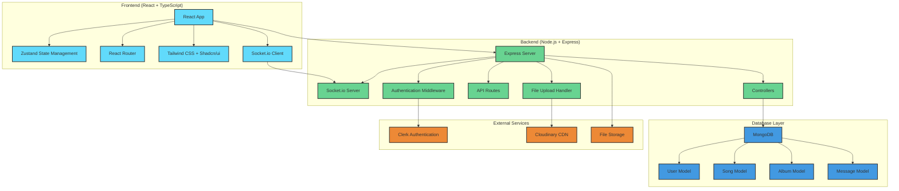
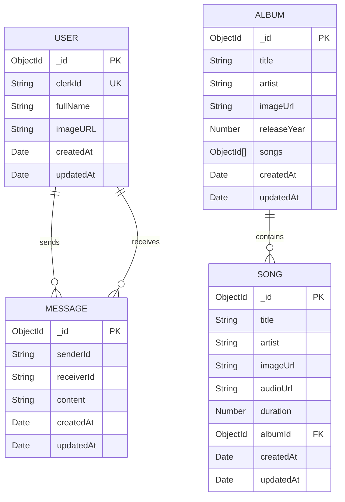
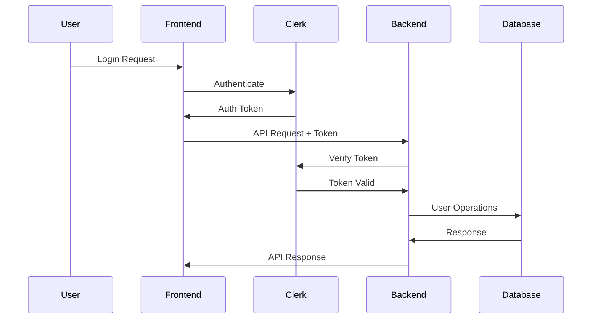

# 🎵 Bettify - Spotify Clone

<div align="center">
  
  
  [](https://opensource.org/licenses/MIT)
  [](https://nodejs.org/)
  [](https://reactjs.org/)
  [](https://www.typescriptlang.org/)
  [](https://www.mongodb.com/)
  
  **A full-stack Spotify clone with real-time features, admin dashboard, and modern UI**
</div>

## 📋 Table of Contents

- [🎵 Bettify - Spotify Clone](#-bettify---spotify-clone)
  - [📋 Table of Contents](#-table-of-contents)
  - [✨ Features](#-features)
  - [🏗️ Architecture Overview](#️-architecture-overview)
  - [📊 Database Schema](#-database-schema)
  - [🚀 Tech Stack](#-tech-stack)
  - [📁 Project Structure](#-project-structure)
  - [🛠️ Installation](#️-installation)
  - [⚙️ Configuration](#️-configuration)
  - [🚦 Running the Application](#-running-the-application)
  - [📚 API Documentation](#-api-documentation)
  - [🎨 UI Components](#-ui-components)
  - [🔒 Authentication & Authorization](#-authentication--authorization)
  - [💬 Real-time Features](#-real-time-features)
  - [🎵 Audio Features](#-audio-features)
  - [📱 Responsive Design](#-responsive-design)
  - [🧪 Testing](#-testing)
  - [🚀 Deployment](#-deployment)
  - [🤝 Contributing](#-contributing)
  - [📄 License](#-license)

## ✨ Features

### 🎵 Music Features

- **Audio Streaming** - Play, pause, skip, and control volume
- **Playlist Management** - Create and manage custom playlists
- **Album Browsing** - Browse albums with song listings
- **Search Functionality** - Search for songs, albums, and artists
- **Featured Content** - Curated featured songs and trending music
- **Made For You** - Personalized song recommendations

### 👥 Social Features

- **Real-time Chat** - Chat with friends while listening
- **User Activity** - See what friends are currently playing
- **Online Status** - View who's online and offline
- **Friend Activity Feed** - Real-time updates of friend activities

### 🎛️ Admin Features

- **Content Management** - Add, edit, and delete songs and albums
- **File Upload** - Support for audio and image file uploads
- **Analytics Dashboard** - View platform statistics
- **User Management** - Monitor user activity and engagement

### 🔒 Security Features

- **Authentication** - Secure login with Clerk
- **Authorization** - Role-based access control
- **Admin Panel** - Protected admin routes
- **Data Validation** - Input sanitization and validation

## 🏗️ Architecture Overview



## 📊 Database Schema



## 🚀 Tech Stack

### Frontend

- **Framework**: React 18 with TypeScript
- **Styling**: Tailwind CSS + Shadcn/ui components
- **State Management**: Zustand
- **Routing**: React Router DOM
- **HTTP Client**: Axios
- **Real-time**: Socket.io Client
- **Build Tool**: Vite
- **Authentication**: Clerk React

### Backend

- **Runtime**: Node.js
- **Framework**: Express.js
- **Database**: MongoDB with Mongoose
- **Authentication**: Clerk Express
- **Real-time**: Socket.io
- **File Upload**: Express-fileupload
- **Cloud Storage**: Cloudinary
- **Task Scheduling**: Node-cron

### DevOps & Tools

- **Package Manager**: npm
- **Version Control**: Git
- **Code Quality**: ESLint, TypeScript
- **Development**: Nodemon, Vite dev server

## 📁 Project Structure

```
bettify/
├── 📁 backend/                    # Backend API server
│   ├── 📁 src/
│   │   ├── 📁 controller/         # Request handlers
│   │   │   ├── admin.controller.js
│   │   │   ├── album.controller.js
│   │   │   ├── auth.controller.js
│   │   │   ├── song.controller.js
│   │   │   ├── stat.controller.js
│   │   │   └── user.controller.js
│   │   ├── 📁 libs/               # Utility libraries
│   │   │   ├── cloudinary.js
│   │   │   ├── db.js
│   │   │   └── socket.js
│   │   ├── 📁 middleware/         # Express middleware
│   │   │   └── auth.middleware.js
│   │   ├── 📁 models/             # Database models
│   │   │   ├── album.model.js
│   │   │   ├── message.model.js
│   │   │   ├── song.model.js
│   │   │   └── user.model.js
│   │   ├── 📁 routes/             # API routes
│   │   │   ├── admin.route.js
│   │   │   ├── album.route.js
│   │   │   ├── auth.route.js
│   │   │   ├── song.route.js
│   │   │   ├── stat.route.js
│   │   │   └── user.route.js
│   │   ├── 📁 seeds/              # Database seeders
│   │   │   ├── albums.js
│   │   │   └── songs.js
│   │   └── index.js               # Server entry point
│   ├── 📁 temp/                   # Temporary file storage
│   └── package.json
├── 📁 frontend/                   # Frontend React app
│   ├── 📁 public/                 # Static assets
│   │   ├── 📁 albums/
│   │   ├── 📁 cover-images/
│   │   ├── 📁 songs/
│   │   └── bettify.png
│   ├── 📁 src/
│   │   ├── 📁 components/         # Reusable UI components
│   │   │   ├── 📁 ui/             # Shadcn/ui components
│   │   │   ├── 📁 Skeletons/      # Loading skeletons
│   │   │   ├── SignInOAuthButton.tsx
│   │   │   └── Topbar.tsx
│   │   ├── 📁 layout/             # Layout components
│   │   │   ├── 📁 components/
│   │   │   ├── AudioPlayer.tsx
│   │   │   └── MainLayout.tsx
│   │   ├── 📁 lib/                # Utility functions
│   │   │   ├── axios.ts
│   │   │   └── utils.ts
│   │   ├── 📁 pages/              # Page components
│   │   │   ├── 📁 admin/          # Admin dashboard
│   │   │   ├── 📁 album/          # Album pages
│   │   │   ├── 📁 Chat/           # Chat functionality
│   │   │   ├── 📁 home/           # Home page
│   │   │   ├── 📁 auth-callback/  # Authentication callback
│   │   │   └── 📁 404/            # Error pages
│   │   ├── 📁 providers/          # Context providers
│   │   │   └── AuthProvider.tsx
│   │   ├── 📁 stores/             # Zustand stores
│   │   │   ├── useChatStore.ts
│   │   │   ├── useMusicStore.ts
│   │   │   └── usePlayerStore.ts
│   │   ├── 📁 types/              # TypeScript types
│   │   │   └── index.ts
│   │   ├── App.tsx                # Main app component
│   │   ├── main.tsx               # App entry point
│   │   └── index.css              # Global styles
│   ├── package.json
│   └── vite.config.ts
├── .gitignore
├── package.json                   # Root package.json
└── README.md
```

## 🛠️ Installation

### Prerequisites

- Node.js (v18 or higher)
- npm or yarn
- MongoDB database
- Cloudinary account
- Clerk account

### Clone the Repository

```bash
git clone https://github.com/MaximumCell/bettify.git
cd bettify
```

### Install Dependencies

```bash
# Install root dependencies
npm install

# Install backend dependencies
cd backend
npm install

# Install frontend dependencies
cd ../frontend
npm install
```

## ⚙️ Configuration

### Backend Environment Variables

Create a `.env` file in the `backend` directory:

```env
# Server Configuration
PORT=5000
NODE_ENV=development

# Database
MONGODB_URI=mongodb://localhost:27017/bettify

# Authentication
CLERK_PUBLISHABLE_KEY=your_clerk_publishable_key
CLERK_SECRET_KEY=your_clerk_secret_key

# Admin Configuration
ADMIN_EMAIL=admin@example.com

# Cloudinary Configuration
CLOUDINARY_CLOUD_NAME=your_cloudinary_cloud_name
CLOUDINARY_API_KEY=your_cloudinary_api_key
CLOUDINARY_API_SECRET=your_cloudinary_api_secret
```

### Frontend Environment Variables

Create a `.env` file in the `frontend` directory:

```env
# Clerk Configuration
VITE_CLERK_PUBLISHABLE_KEY=your_clerk_publishable_key

# API Configuration
VITE_API_URL=http://localhost:5000/api
```

## 🚦 Running the Application

### Development Mode

1. **Start the backend server:**

```bash
cd backend
npm run dev
```

2. **Start the frontend development server:**

```bash
cd frontend
npm run dev
```

3. **Seed the database (optional):**

```bash
cd backend
npm run seed:songs
npm run seed:albums
```

### Production Mode

1. **Build the application:**

```bash
npm run build
```

2. **Start the production server:**

```bash
npm start
```

The application will be available at `http://localhost:3000`

## 📚 API Documentation

### Authentication Endpoints

```
POST /api/auth/callback          # Authentication callback
```

### User Endpoints

```
GET  /api/users                  # Get all users
GET  /api/users/:id              # Get user by ID
```

### Song Endpoints

```
GET  /api/songs                  # Get all songs (admin only)
GET  /api/songs/featured         # Get featured songs
GET  /api/songs/made-for-you     # Get personalized songs
GET  /api/songs/trending         # Get trending songs
```

### Album Endpoints

```
GET  /api/albums                 # Get all albums
GET  /api/albums/:id             # Get album by ID
```

### Admin Endpoints

```
GET    /api/admin/check          # Check admin status
POST   /api/admin/songs          # Create new song
DELETE /api/admin/songs/:id      # Delete song
POST   /api/admin/albums         # Create new album
DELETE /api/admin/albums/:id     # Delete album
```

### Statistics Endpoints

```
GET  /api/stats                  # Get platform statistics
```

## 🎨 UI Components

### Component Library

- **Shadcn/ui** - Modern, accessible components
- **Lucide React** - Beautiful icons
- **Tailwind CSS** - Utility-first styling
- **Radix UI** - Unstyled, accessible components

### Key Components

- **Audio Player** - Full-featured music player
- **Playlist Grid** - Responsive song grid layout
- **Chat Interface** - Real-time messaging UI
- **Admin Dashboard** - Content management interface
- **Friend Activity** - Social features sidebar

## 🔒 Authentication & Authorization

### Authentication Flow



### Role-Based Access Control

- **Public Routes**: Song browsing, album viewing
- **Authenticated Routes**: Chat, playlists, user features
- **Admin Routes**: Content management, user administration

## 💬 Real-time Features

### Socket.io Events

```javascript
// Client Events
socket.emit("user_connected", userId);
socket.emit("send_message", messageData);
socket.emit("update_activity", activityData);

// Server Events
socket.on("user_connected", userId);
socket.on("receive_message", message);
socket.on("activity_updated", activity);
socket.on("user_disconnected", userId);
```

### Real-time Features

- **Live Chat** - Instant messaging between users
- **User Presence** - Online/offline status tracking
- **Activity Feed** - Real-time music activity updates
- **Friend Updates** - Live friend activity notifications

## 🎵 Audio Features

### Audio Controls

- **Play/Pause** - Basic playback controls
- **Skip/Previous** - Track navigation
- **Volume Control** - Adjustable audio levels
- **Progress Bar** - Seek functionality
- **Queue Management** - Playlist queuing

### Audio Format Support

- **MP3** - Primary audio format
- **Streaming** - Progressive audio loading
- **Crossfade** - Smooth track transitions

## 📱 Responsive Design

### Breakpoints

- **Mobile**: < 768px
- **Tablet**: 768px - 1024px
- **Desktop**: > 1024px

### Responsive Features

- **Collapsible Sidebar** - Mobile-friendly navigation
- **Resizable Panels** - Customizable layout
- **Touch Controls** - Mobile-optimized interactions
- **Responsive Grid** - Adaptive content layout

## 🧪 Testing

### Running Tests

```bash
# Frontend tests
cd frontend
npm test

# Backend tests
cd backend
npm test
```

### Test Coverage

- **Unit Tests** - Component and function testing
- **Integration Tests** - API endpoint testing
- **E2E Tests** - Full user flow testing

## 🚀 Deployment

### Heroku Deployment

```bash
# Login to Heroku
heroku login

# Create Heroku app
heroku create bettify-app

# Set environment variables
heroku config:set NODE_ENV=production
heroku config:set MONGODB_URI=your_mongodb_uri
# ... other environment variables

# Deploy
git push heroku main
```

### Docker Deployment

```dockerfile
# Build Docker image
docker build -t bettify .

# Run container
docker run -p 3000:3000 bettify
```

### Environment Configuration

- **Production Database** - MongoDB Atlas
- **CDN** - Cloudinary for media files
- **Authentication** - Clerk production keys
- **SSL** - HTTPS configuration

## 🤝 Contributing

### Development Guidelines

1. **Fork the repository**
2. **Create a feature branch**: `git checkout -b feature/amazing-feature`
3. **Commit changes**: `git commit -m 'Add amazing feature'`
4. **Push to branch**: `git push origin feature/amazing-feature`
5. **Open a Pull Request**

### Code Style

- **ESLint** - JavaScript/TypeScript linting
- **Prettier** - Code formatting
- **TypeScript** - Type safety
- **Conventional Commits** - Commit message standards

### Bug Reports

Please use GitHub Issues to report bugs with:

- **Environment details**
- **Steps to reproduce**
- **Expected vs actual behavior**
- **Screenshots** (if applicable)

## 📄 License

This project is licensed under the MIT License - see the [LICENSE](LICENSE) file for details.

---

<div align="center">
  <p>Made with ❤️ by <a href="https://github.com/MaximumCell">MaximumCell</a></p>
  <p>⭐ Star this repository if you found it helpful!</p>
</div>
